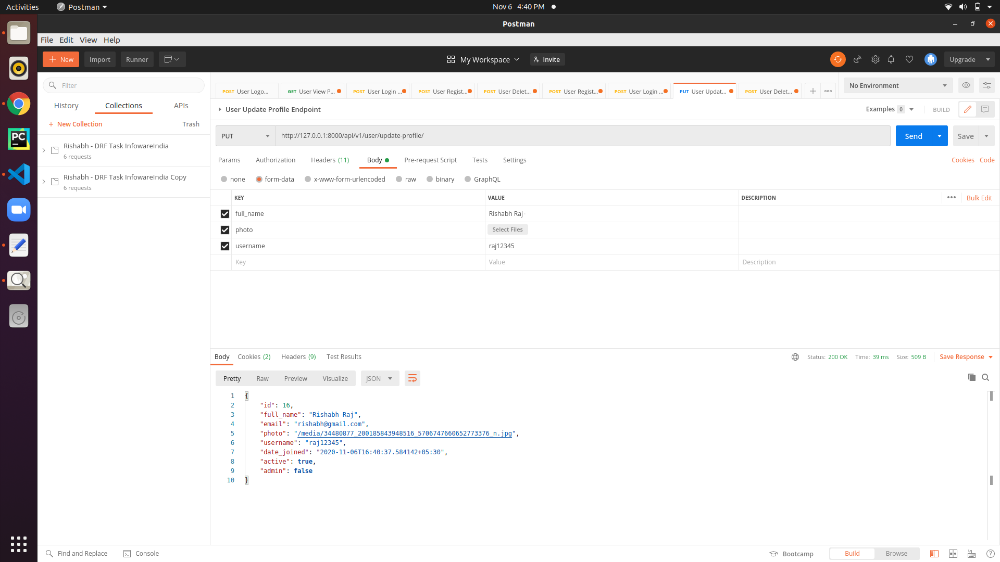

# drf-infoware-task

1. API For User Registeration
Signup where user will register with these data 
Name 
Username
Email
password
photo 

Endpoint : http://127.0.0.1:8000/api/v1/user/register/ 

2. Api for Login where user can login with username/email

Endpoint : http://127.0.0.1:8000/api/v1/user/login/ 

3. Api to view profile - don’t show the password. Users can only view profiles if they’re logged in. Pass the token in header with this API

Endpoint : http://127.0.0.1:8000/api/v1/user/view-profile/ 

4.Api to edit profile - User can  change the details other than email.(Won’t be able to change their email in edit profile). Pass the token in header with this API

Endpoint : http://127.0.0.1:8000/api/v1/user/update-profile/

5.Api for Delete user profile. Pass the token in header with this API

Endpoint : http://127.0.0.1:8000/api/v1/user/delete-profile/

